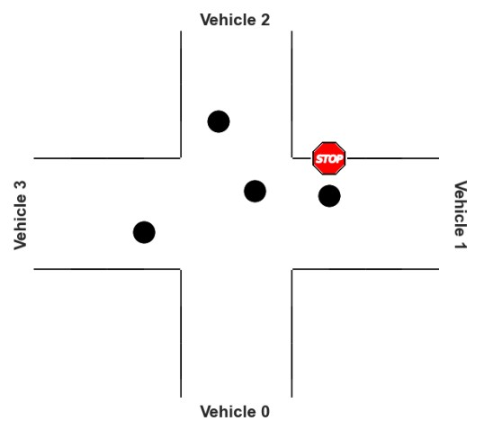

# Artificial Intelligence Exercises
This repository shows part of exercises of lecture Artificial Intelligence in Technical University of Munich, which contains topics:  
- Hidden Markov Model (Viterbi Algorithm, Particle Filtering for robot localization)
- Constraint Satisfaction Problem
- Logic Problem

The codes are shown in .ipynb file of the corresponding folders.

## Hidden Markov Model
This exercise contains two sub-problems: Viterbi Algorithm and Particle Filtering. Some brief introduction is following. 

###Viterbi Algorithm
Image you have a sweeping robot vacuum cleaner at home to help you keep the floor clean. The robot has a camera for detecting the floor color beneath it to help it localize itself. But the camera is not perfect. So, the robot might also observe other colors instead of the actual floor color with a low probability. Now, we help our robot to get the most likely sequence of its positions based on the sequences of detected color.

Firstly, we create a map with random color, and then define prior, transition model, sensor model, and Viterbi Algorithm.  
And finally, we get a most likely trajectory.

###Particle Filtering for robot localization
We use Particle Filtering to track a moving robot's position over time. In this setting, we have access to the steering and velocity control inputs. We also have sensors that measure the distances to visible landmarks. The basic principle of particle filtering is then that the population of particles tracks the high-likelihood regions of the robot's position.

##Constraint Satisfaction Problem
The student union is planning to hold a welcome party for the new students. 8 Students (Abigail, Brian, Caroline, Daniel, Edith, Frank, Grace, Harold) volunteer to perform in several shows. The following four types of shows are allowed to be performed on the party. (Each type of show is performed no more than once): Singing (costume for each student costs 50), Dancing (costume for each student costs 80), Comedy, Piano performance (costume for each student costs 100)  

There are some constraints for students and their shows. We should implement codes to give an assignment which also fulfills the corresponding constraints.

##Logic Problem
In this exercise, we should obtain driving order of vehicles in an intersection with some knowledge base.

####The statements of problems above are described in three pdf file, respectively and the main codes are listed in the corresponding folders.
